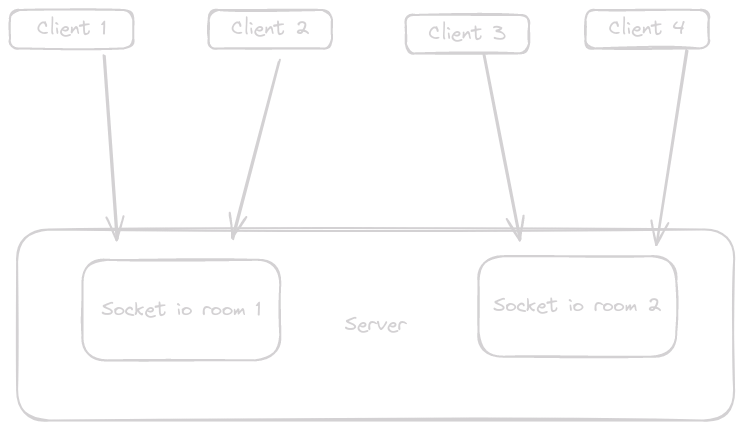
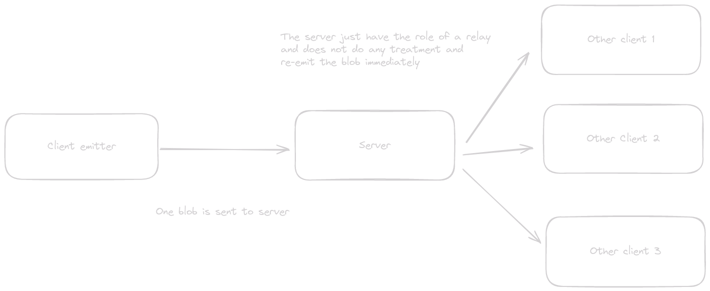

# Channel communication voice/video

Auteur: HugoP 
Tag: back

## Socket.io

To manage web socket connethe server re-emit in all sockets of the same room the StreamPayloadction we will use the framework [socket.io](https://socket.io/fr/docs/v3/).

## What are we doing in beep ?

### Let’s see that slowly

.png)

You can see here a simplified version of what is really happening in beep. Don’t be scarred about sockets.  

### Connection to rooms/channels

In beep a web socket is created everytime a user login to the application. Then we just manage the state of this opened socket. Each time a user join a beep channel in reality he joins a [socket io](http://socket.io) room. You can see the full use of this api [here](https://socket.io/fr/docs/v3/rooms/).

A little scheme to ease your fears:

In that scheme arrow symbolize web sockets. 4 web sockets are created between 4 differrent clients and the server. 2 client are connected in the first room. 2 client are connected in the second room

As you can see we didn’t bring up audio/video sources yet. Once he is connected to a socket io room he will receive the video/audio of all user in that channel. But let’s focus on that in the next part.

### Audio/video flux

In reality our server is more working like a relay. Each time the server receive video/audio from a client he will immediatly broadcast it back to all connected socket that are in the same room of the emitter.

*Note: if the server was doing a real broadcast the emitter could receive his own audio/video stream. You can prevent that with socket io pretty easily*

The video/audio streams are short [Blobs](https://developer.mozilla.org/en-US/docs/Web/API/Blob)  [emitted](https://socket.io/fr/docs/v3/emitting-events/) in message payloads message in the socket. Those Blobs are send to the server. When a blob is received it is immediately broadcast to sockets that are in the same room. 

Don’t forget that clients are in the same room/channel