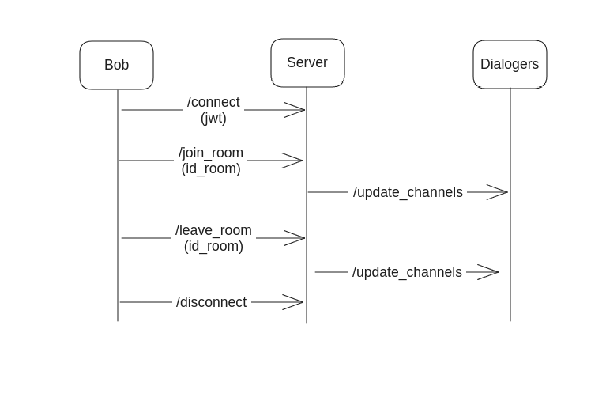

# Protocole Socket [Voice]

Auteur: Tristan
Tag: back



## Error handling

Toutes les réponses d’erreurs sont captées par l’évènement “error”.

Le traitement doit être fait en conséquence selon le code d’erreur et/ou le message d’erreur

```json
{
 "code": number,
 "message": string
}
```

## Events

### Connect

→ géré nativement par socket.io

### Join channel

**Event : “**join_channel”
**Payload :**

```json
{
 "channel_id": string
}
```

**Error :**

```json
{
    code: 401,
    message: 'Unauthorized access',
}
```

### Leave channel

**Event : “leave**_channel”
**Payload :**

```json
{
 "channel_id": string
}
```

### Disconnect

Géré par socket io
