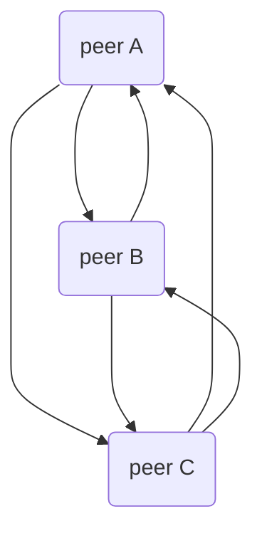
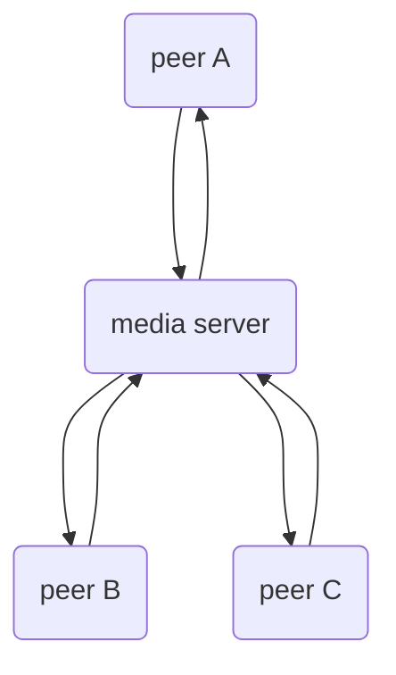
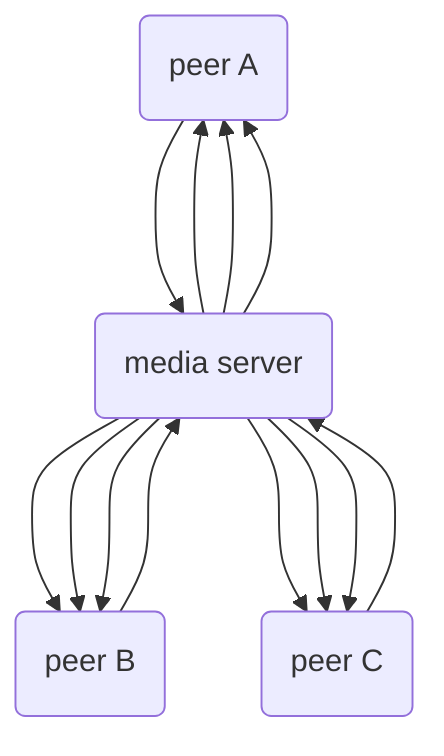
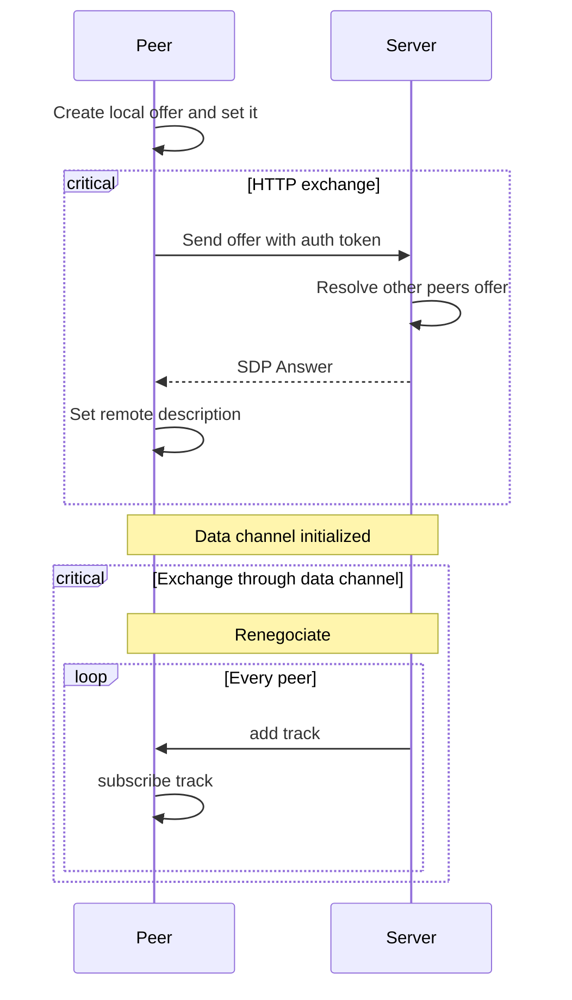

# WebRTC and SFU

## Introduction
Beep provides real-time voice and camera chat. To implement that feature we had to rely on a set of web technologies called WebRTC making media manipulation and transmission easier.
is basically and SDK provided [WebRTC](https://webrtc.org ) is basically a Javascript SDK provided by your browser and a set of protocols enabling media transfer over the Internet. These protocols are [STUN](https://datatracker.ietf.org/doc/html/rfc5389), [TURN](https://datatracker.ietf.org/doc/html/rfc5766) and [ICE](https://datatracker.ietf.org/doc/html/rfc5245) (refer to the next chapter to get a description of these protocols), their role is to start a communication between two peers even if they are separated by firewalls or NAT. They are mandatory when starting a connection between two peers with WebRTC.
Basically, Voice-over-IP (VoIP) can be designed three ways : 
1. **Peer-to-peer (mesh)** : each member of the chat send their medias to every other members. This approach comes with some drawbacks since P2P can be unstable, slow and unsafe. Though this architecture is free of charge and quite easy to set-up.

2. **Multipoint control unit (MCU)** : each member of the chat send their data to a central server that acts as a multiplexer, therefore the server sends to each member a mix of every other member video/audio. This approach is quite complex since it implies implementing a multiplexing/demultiplexing algorithm to make sure that each member media is represented by a single track. Also this approach is not cheap.

1. **Selective forward unit (SFU) :** Similarly to MCU, each peer of an SFU architecture needs to send their media to a media server, but this time, the media server only acts as a relay by sending separately to each peer every other member track's. SFU therefore is easier to implement, is quite flexible since we control each media stream and are able to perform media compressing or dynamic stream adaptation (like DASH). Also this approach is the most scalable since the media server only acts as a relay between two peers, scaling to two or more relay servers wouldn't break the chat room system.

We chose the SFU architecture because it provides the simplicity of the MCU architecture with as much control on each stream as the Peer to peer architecture.
## Glossary

1. **STUN (Session Traversal Utilities for NAT)**: A protocol used to discover the public IP address and port mappings that a client device is using behind a Network Address Translator (NAT). This allows devices to establish peer-to-peer connections by learning their external network address.
2. **TURN (Traversal Using Relays around NAT)**: A protocol that facilitates the relay of media traffic between two devices when a direct peer-to-peer connection is not possible, typically due to strict NAT or firewall settings. TURN servers relay the data between the peers, ensuring connectivity.
3. **ICE (Interactive Connectivity Establishment)**: A framework that combines STUN and TURN to facilitate NAT traversal for establishing direct peer-to-peer (P2P) connections. ICE iteratively tests multiple candidate paths (e.g., direct and relayed) between two devices to find the best working path for communication.
## Protocol
SFU transmission can be broken down into three steps : 
1. **Signalling** : each peers need to declare their presence to the media server so it can establish an ICE connection with the other peers.
2. **Session connection** : once the peer has been correctly signalled, the session is established and data is ready to be sent to the peer and by the peer.
3. **Streaming** : this is the step where data is being exchanged.

### Signalling
#### Authentication

#### Signals
### Transmission

## Further details