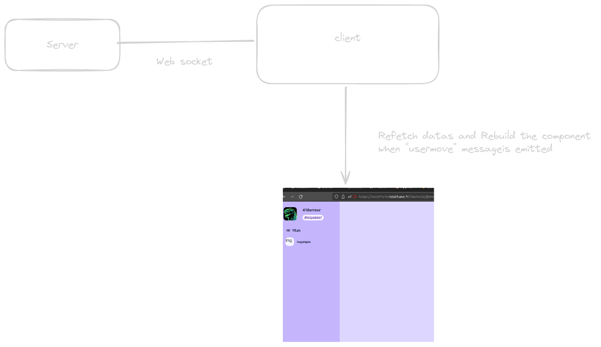
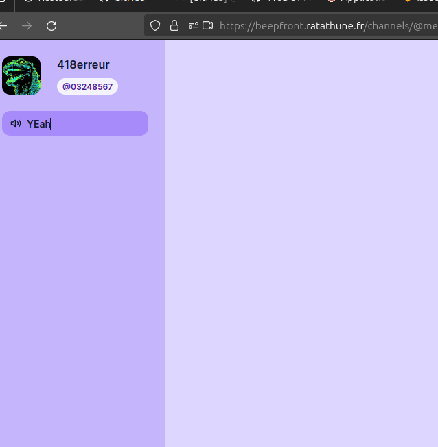

# Display user in voice channels

Tag: front

We will see in this documentation what is the flow of datas to display and update users in voice channels.

## Before hand

A web socket is constantly open between the client and the server. This websocket will let us know each time someone connect or disconnect from a channel.

## So what’s going on ?

The client listen to message in the websocket and each time “usermove” is received we ask to the  api the new state of connected user in all channels (at least displayed channel)

## Use case for example

Imagine as client being able to see one voice channel. Like this:

Each time a user will connect  a channel he will emit “usermove” in the websocket. Every connected client will listen to this particular event. When the message is received the frontend will react and refetch all datas.

