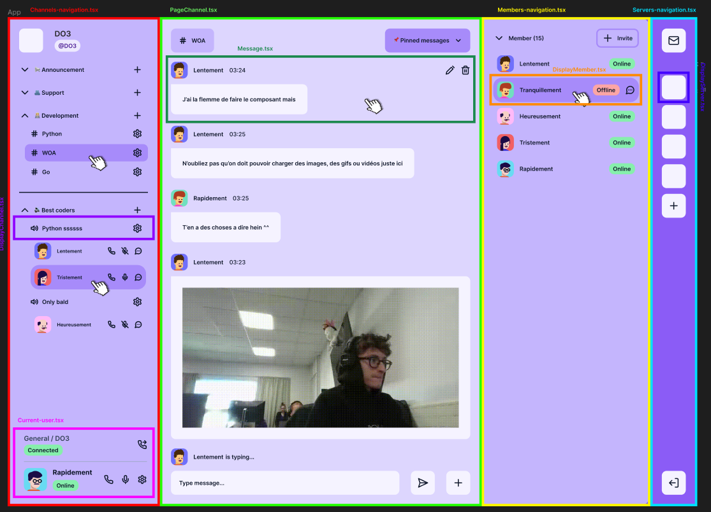

# Figma des composants

Auteur: Dorian Grasset
Tag: design, front

# Composition globale de l’UI de l’application en composants

> Sur cette image pour pouvez trouver d’un coup d’oeil le composant sur lequel vous voulez travailler.
> 

