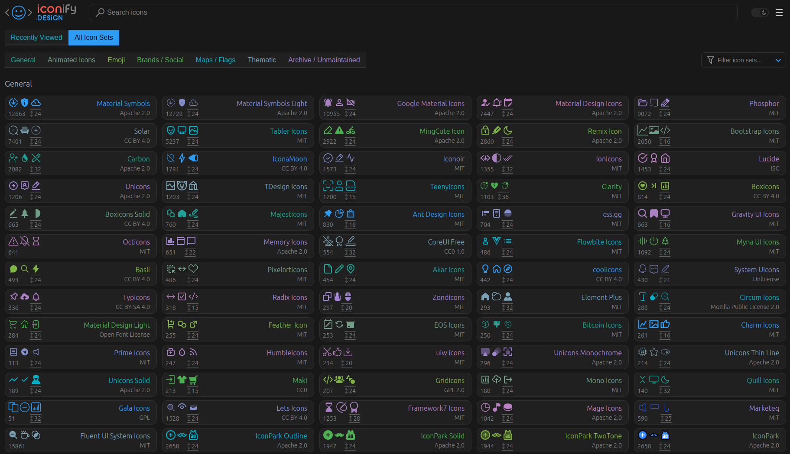

# Utiliser une icone Iconify

Auteur: Dorian Grasset
Tag: front

`Iconify` est une bibliothèque d'icônes qui facilite l'intégration et l'utilisation d'icônes dans les applications web. Elle offre aux développeurs un accès à une vaste bibliothèque d'icônes provenant de différentes sources telles que FontAwesome, Material Design Icons, Lucide Icons, et bien d'autres encore.

L'un des avantages clés d'Iconify est son système de chargement dynamique des icônes. Contrairement à d'autres méthodes où toutes les icônes sont téléchargées au chargement de la page, Iconify ne charge que les icônes nécessaires au fur et à mesure de leur utilisation. Cela permet d'optimiser les performances de l'application en réduisant la quantité de données à télécharger initialement, ce qui est particulièrement avantageux pour les applications avec de nombreuses icônes.

De plus, Iconify propose une intégration facile avec différents frameworks et bibliothèques front-end tels que React, Vue.js, Angular, et même avec du HTML et du CSS pur. Il fournit des composants ou des balises simples à utiliser pour afficher les icônes dans l'interface utilisateur, simplifiant ainsi le processus de développement.

Un autre avantage majeur est la mise à jour automatique des icônes. Les icônes utilisées dans une application via Iconify sont automatiquement mises à jour lorsque de nouvelles versions sont publiées. Cela garantit que les icônes utilisées restent à jour avec les dernières versions disponibles, sans nécessiter d'intervention manuelle de la part des développeurs.

Lorsque vous allez devoir utiliser une icone, vous devrez utiliser `Iconify`, pour cela rien de très compliqué.

Commencez par instancier un composant `Icon` :

```tsx
import { Icon } from '@beep/ui'

<Icon />
```

L’icone peut prendre en propriétés des `classes` et surtout une propriété `name`  qui va nous permettre de définir l’icone voulue.

Pour trouver votre icone, rendez vous sur ce [lien](https://icones.js.org/).

Vous devriez arriver sur cette interface :



1. Commencez par cherchez la librairie qui vous intéresse, on va prendre ici l’exemple de `LucideIcon` :  


1. Rechercher l’icone souhaité : 


1. Copiez le composant le champ `icon` du composant que vous verrez, ici `lucide:hash` :


1. Retournez sur votre code et complétez-le en ajoutant dans la propriété `name` ce que vous avez dans le presse-papiers et personnalisez le comme vous le souhaitez :

```tsx
import { Icon } from '@beep/ui'

<Icon name="lucide:hash" className="w-4 h-4" />
```

<aside>
⚠️ Notre composant utilise la propriété `name` alors que le composant que vous allez copier/coller utilise la propriété `icon`, tout fonctionne de la même façon, pensez juste à le modifier !

</aside>