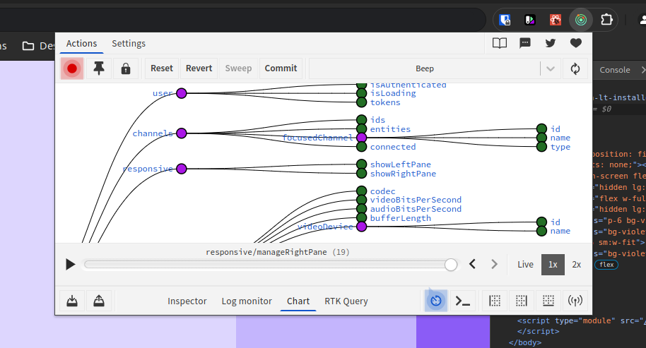

# Prérequis et premier lancement (front)

Auteur: Dorian Grasset, Théo Tchilinguirian
Tag: front

## Prerequisites

Vous devez avoir installé `pnpm` : `sudo npm install -g pnpm` pour l’installer si ce n’est pas déjà fait.

## Lancer le front pour la première fois

Clonez le repo et placez vous dans le dossier.

Créez un fichier `.env` avec le contenu suivant :

```bash
VITE_BACKEND_URL=http://localhost:3333/
```

Installez les dépendances :

```bash
pnpm install
```

Démarrez le frontend :

```bash
pnpm run start
```

## Redux DevTools

Start by installing the `Redux DevTools` web extension :
[https://chromewebstore.google.com/detail/redux-devtools/lmhkpmbekcpmknklioeibfkpmmfibljd](https://chromewebstore.google.com/detail/redux-devtools/lmhkpmbekcpmknklioeibfkpmmfibljd)

This will allow you to see all the states of the application in real time, and explore what happened in the linear history of events :



When your application is launched in localhost, click on the extension. Then, in the top navbar click on `Actions` and in the bottom navbar, click on `Chart`. You should normally see the state tree appear.
