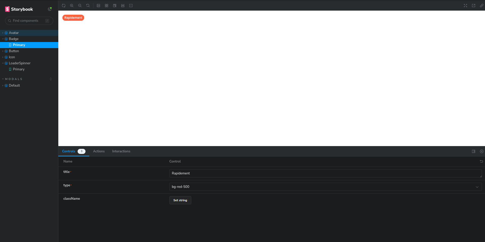

# Storybook

Auteur: Dorian Grasset
Tag: front

# Lancer Storybook

Pour faire ceci exécutez la commande suivante dans votre terminal :

```bash
$ pnpm storybook
```

# Présentation de Storybook

Lorsque vous aurez lancé votre storybook en local vous arriverez sur une page comme celle-ci :



1. **Les différents composants**

Comme vous pouvez le voir sur la capture d’écran, vous avez ici les différents composants de l’application (Avatar, Badge…). Lorsque vous cliquerez sur un de ces composants, vous pourrez voir les différentes variantes de celui-ci :


1. **L’aperçu**

Lorsque vous aurez sélectionné un des composants (ici Badge) vous aurez un aperçu de celui-ci :


1. **Les propriétés**

Mais vous aurez aussi accès à toutes les propriétés de ce composant. C’est-à-dire que vous pourrez les modifier pour voir les différents aperçus de celui-ci :


# Faire le Storybook de son composant

Dans Beep, les composants sont minimalistes, reprenant souvent les balises HTML de base. Ils sont conçus pour être génériques, facilement utilisables et personnalisables selon les besoins :

- **Minimalistes :** Ils incluent uniquement les éléments essentiels.
- **Génériques :** Utilisables dans différentes parties de l'application.
- **Facilement utilisables :** Importables et utilisables simplement.
- **Personnalisables :** Possibilité d'ajuster leur apparence et leur comportement selon les besoins

Une fois que vous avez votre composant (prenons l’exemple du composant Badge) vous pouvez suivre le guide pour créer son Storybook :

1. **Créer le fichier**
    
    Tout d’abord créer votre fichier qui aura le nom `{nom-du-composant}.stories.tsx` dans le dossier de votre composant :
    
    ```tsx
    front
    └── libs
        └── shared
            └── ui
                └── src
                    └── lib
                        └── components
                            └── badge
                                ├── badge.tsx
                                └── badge.stories.tsx
    ```
    
2. **Écrire le Storybook**
    
    Une fois le fichier instancié, vous allez pouvoir créer votre premier Storybook comme suit :
    
    1. **Imports**
        
        Vous pouvez commencer par importer `StoryFn` de `@storybook/react` ainsi que votre composant, ses propriétés (et parfois ses types si il en a).
        
        ```tsx
        // badge.stories.tsx
        
        import { StoryFn } from '@storybook/react'
        import { Badge, BadgeProps, BadgeType } from './badge'
        ```
        
    2. **Configuration**
        
        Le bloc **`export default`** configure Storybook pour ce composant en définissant le composant à utiliser et en lui donnant un titre (le titre est le nom que vous donnerez au composant dans la liste de composants de Storybook).
        
        ```tsx
        // badge.stories.tsx
        
        export default {
          component: Badge,
          title: 'Badge',
        }
        ```
        
    3. **Template**
        
        Le template est une fonction qui prend les arguments du composant et les rend. Dans cet exemple, **`Template`** est défini comme une fonction prenant les props d'un **`Badge`** et rendant un **`Badge`** avec ces props.
        
        ```tsx
        // badge.stories.tsx
        
        const Template: StoryFn<BadgeProps> = (args) => <Badge {...args} />
        ```
        
    4. **Variants**
        
        Chaque variante du composant est exportée comme une constante. Dans ce cas, une seule variante est définie (**`Primary`**). Cette variante est liée au template défini précédemment en utilisant **`Template.bind({})`**.
        
        ```tsx
        // badge.stories.tsx
        
        export const Primary = Template.bind({})
        ```
        
    5. **Propriété**
        
        Les propriétés de la variante sont définies en utilisant **`args`**. Pour la variante **`Primary`**, la propriété **`title`** est définie comme "Rapidement" et la propriété **`type`** est définie comme **`BadgeType.DANGER`**. Cela permet de visualiser le composant dans différentes configurations dans l'interface de Storybook.
        
        ```tsx
        // badge.stories.tsx
        
        Primary.args = {
          title: 'Rapidement',
          type: BadgeType.DANGER,
        }
        ```
        
    6. **Résultat**
        
        ```tsx
        import { StoryFn } from '@storybook/react'
        import { Badge, BadgeProps, BadgeType } from './badge'
        
        export default {
          component: Badge,
          title: 'Badge',
        }
        
        const Template: StoryFn<BadgeProps> = (args) => <Badge {...args} />
        
        export const Primary = Template.bind({})
        
        Primary.args = {
          title: 'Rapidement',
          type: BadgeType.DANGER,
        }
        ```
        
    1. **Visualiser votre Storybook**
        
        Maintenant, que vous avez réalisé votre première documentation de composant, vous pouvez lancer Storybook comme vous l’avez vu au début !
        

# Documentation

[https://storybook.js.org/docs/get-started](https://storybook.js.org/docs/get-started)