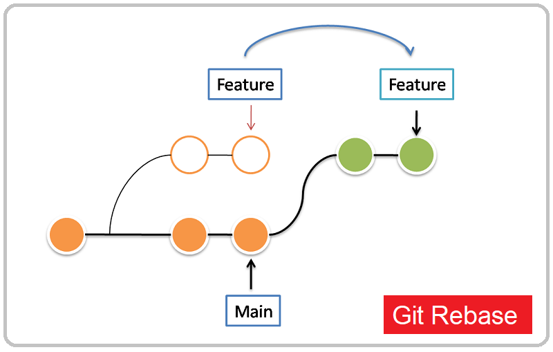
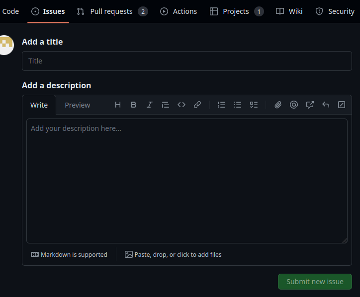
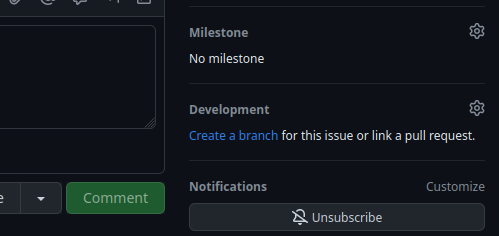
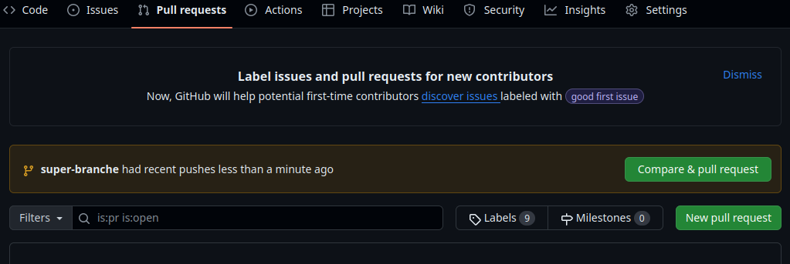
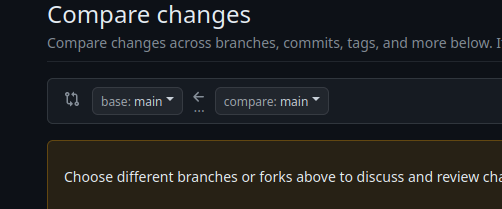
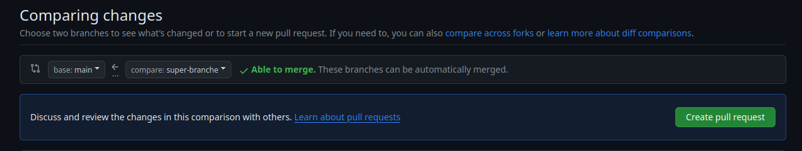
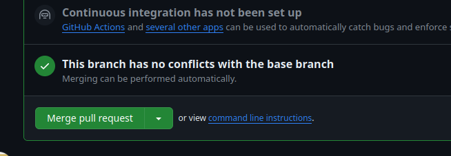
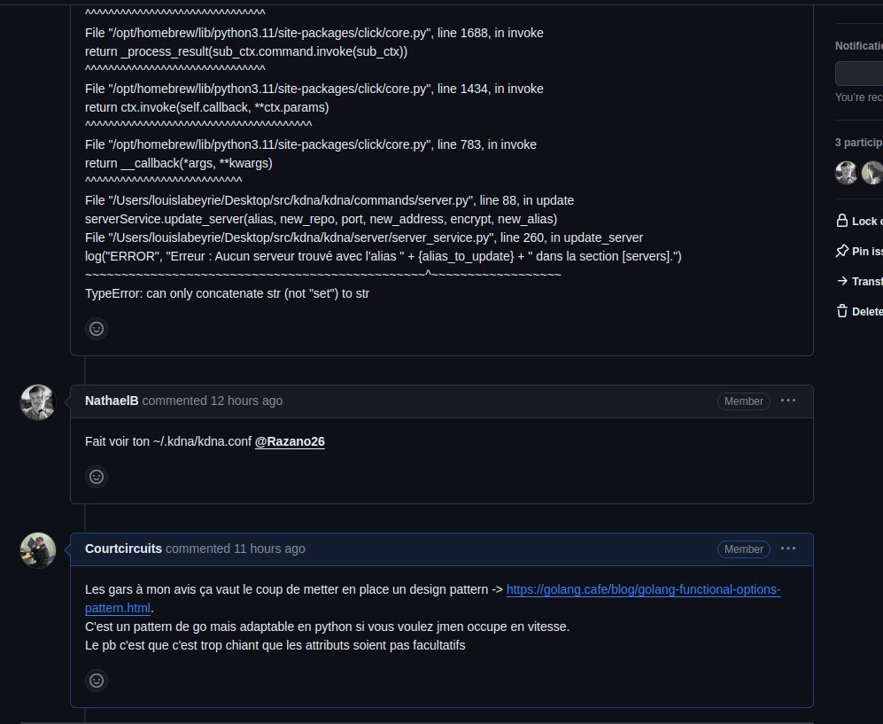

# Git c’est bien mais j’en fais quoi ?

Tag: git

Vous connaissez les fameuses:

```bash
git add /path/to/file
git commit -m "wonderful commit"
```

- N.B: Ne commitez pas sur la branche principale tout et n’importe quoi. Elle doit proposer la version la plus stable du projet en cours.

Mais connaissez-vous :

```bash
 git pull --rebase origin main
```

Cette commande permet de récupérer l’avancement de main sur votre branche sur le
bout de la branche visée:



*Comme vous pouvez le voir votre branche sera à jour sur main. Cependant peut-être que des conflits seront peut-être à résoudre.*

## Les Conflits :

Votre IDE préféré propose surement une manière très jolie de résoudre les conflits. Prenez le temps de le résoudre le plus souvent possible.

En effet, si vous ne rebasez jamais vous créez un véritable effet boule de neige pour vous et vos collègues. N’hésitez pas à poser des questions avant une session intense de gestion de conflits afin de ne pas dénaturer le projet.

Si aucun conflit n’est à gérer lors d’un rebase tant mieux pour vous.

La résolution d’un conflit se déroule de la façon suivante :

```bash
git pull --rebase origin <branche-source-de-vérité>
```

Votre répo local sera checkout sur le commit distant qui est en conflit avec votre branche locale. Ainsi `git status` devrait indiquer que vous vous situez sur un tag de commit.

Vous devez maintenant chercher le conflit et le résoudre. Pour ça vous pouvez utiliser l’outil intégré par les outils Jetbrains, la popup `Resolve conflict` avec VSCode ou bien l’extension [Git fugitive](https://github.com/tpope/vim-fugitive) + la commande `:Gvdiffsplit!` sur Neovim (si t’es un bonhomme).

Une fois le conflit réglé il faut `git add` les fichiers modifiés lors de la résolution.

Éventuellement, vous pouvez commit.

Pour passer au conflit suivant → `git rebase --continue`

Lorsque la cli git vous indique que tous les conflits ont été réglé, vous pouvez commit les modifications si ça n’a pas été encore fait. Enfin, vous pouvez push sur votre branche de développement et créer une PR.

# Issues, PR et autres MR …

*N.B: Cette partie concerne GitHub et GitLab et les bonnes pratiques, les PR (Pull Request sur Github) et MR (Merge Request sur GitLab). Au fait considérez que MR=PR.*

Dans un projets les “issues” permettent de définir les différentes
tâches après la conception du projet. 

*Exemple: Je veux créer une nouvelle feature. Je créer une issue et je définie à l’intérieur les
spécifications, les inconnues, les possibilités de procéder… (tout ce
qui vous semble pertinent)*

Elles peuvent aussi mettre en lumière des bugs à résoudre sur l’application.

*Exemple: Créer une issue de fix afin de gérer au mieux le fait que les derniers commits ont cassé l’application.* 



*Exemple: Ouvrir une issue sur GitHub*

Sachez que les issues ne sont pas facturées ni par GitHub ni par GitLab donc fait en un max. Une issue se ferme dans le cas où elle n’est pas pertinente donc n’hésité pas à en ouvrir. Cela prend tous son sens pour signaler sur des modules que vous n’avez pas écrit des problèmes.
Pitié ne modifiez pas à tort et à travers les fichiers de tout le projet, fait des issues pour signaler les problèmes.

## PR et MR

Vous avez définis vos issues ?? 

C’est magnifique il est temps de coder. Nan ! Créer des PR/MR (2 méthodes)

### 1. A partir de vos Issues (recommandé)

Vous pouvez à partir de l’issue:



### 2. A la main (c’est bon de le savoir)

 Créer vos branches à la main de manière local:

```bash
git checkout -b super-nom-de-branche
```

> En utilisant la commande **`git checkout -b`** en Git, le **`-b`** signifie "branch" (branche en français). Cette commande permet de créer une nouvelle branche et de passer instantanément sur cette nouvelle branche.
> 

Puis publiez la :

```bash
git push origin super-nom-de-branche
```

Faites vos modifications sur la branche et fait un premier commit.

### Puis vous pourrez utiliser “New Pull Request”:



*On peut voir ici que GitHub le propose par défaut mais on ne sait jamais nous allons prendre le
chemin de la sécurité*

Sur la page d’arrivé porté votre attention sur la partie:î



Ici la branche à s’appelle “super-branche”. Utilisez les menus
déroulant pour vous retrouvez dans un état similaire:



Noter que compare à changer de “main” à “super-branche”. Vous pouvez
maintenant utiliser “Create pull request”. 

Laissez vous guider pour finir la procédure. Décrivez du mieux que vous pouvez votre PR pour les
Reviewers. Il est fortement recommandé d’ajouter des Reviewers, cette option est sur la droite de l’écran. Vous pouvez ensuite faire “Create Pull Request”

## Mais moi je veux merge maintenant !

Vous avez fini. Vous avez testé votre code. Il est répond aux attentes
du projet. Vous avez rebase ?  Demandez aux reviewers d’accepter votre PR puis …

Let’s go merge avec: 



 *Directement disponible sur votre PR.* 

Plusieurs options sont disponibles. L’option choisie dépendra des choix du projet.

Évidemment votre branche doit être à jour sinon vous connaissez la
chanson:

```bash
git pull --rebase origin main
```

N’hésitez pas à refaire la commande toutes les 10 minutes. Et réglez vos conflits

Vous êtes arrivez jusque là ? Envoyez moi “Chaussure au fromage” sur discord

## Communication

Utilisez le fil de discussion des issues !!!!!!! Ça permet de garder une trace de la réflexion derrière la résolution d’une issue, mais également de se coordonner facilement.

