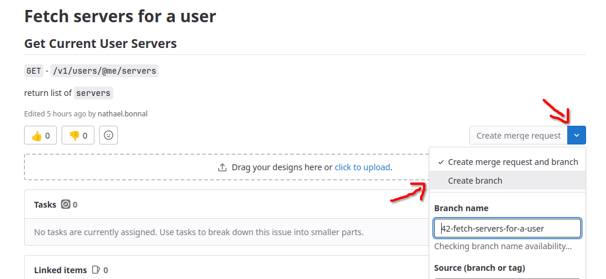

# — Workflow (Trunk based development) —

Tag: git

# Workflow Git

Un workflow, c’est une méthode de travail qui permet à une équipe de collaborer efficacement et correctement sur un même projet.

Le workflow est une des briques fondamentales d’une équipe, s’il est mal défini, mal appliqué, mal standardisé ou que tous ne soient pas à l’aise avec, des problèmes vont se répercuter sur la suite du projet.

---

## Workflow résumé

Issue → Branche → … → **tests** → **Merge Request** → **Review x1** → **Review x2** → Merge.

Sachant que Review = **Relecture du code modifié + Tests.**

---

## Voici notre workflow…

Tout commence par une issue.

<aside>
💡 Les issues devraient être assignées selon leur priorité (”backlog”), et selon les capacités de chacun. C’est ainsi que cela va fonctionner dans la suite du projet.

</aside>

Une fois une issue attribuée, vous pouvez travailler dessus.

→Depuis Gitlab, vous pouvez créer une branche à partir d’une issue :

Récupérez la branche en local, et travaillez dessus. SI vous êtes bloqué, allez voir la doc (doc Notion, doc de l’outil…) et si ça coince, n’hésitez pas à faire du pair programming ! Ça permet de gagner beaucoup de temps, et d’apprendre beaucoup de choses efficacement.

**Vous avez fini d’implémenter votre feature sur votre branche ? L’issue est terminée ?**

Pas si vite ! Vous devez *impérativement* avoir réalisé une batterie de tests !
Une issue peut être un élément atomique, simple. Il est alors pas trop complexe de se repérer dans les parties du code affectées par le code que l’on a écrit. Les possibles erreurs pourraient venir de là.
Il est impératif de tester les fonctionnalités de l’appli :

- Peut-on créer un compte ?
- Peut-on se connecter ?
- Peut-on rejoindre un channel ? etc….

C’est du click-click, c’est assez rapide, et faire le tour de Beep est sympatchique car l’UI de Dodo est très zolie 🙏.

<aside>
⚠️ Nous n’avons pas encore défini la batterie de tests standard à effectuer pour tester l’appli. On fait confiance à vos capacités de ⚡ testeurs.ses ⚡pour le moment 🥴

</aside>

L’appli a passé vos tests ? Une fois push, vous pouvez créer une Merge Request et assigner un premier reviewer.

Le boulot de le ou la reviewer va être de relire votre code, et d’effectuer des tests de leur côté.

L’expérience a montré qu’un reviewer ne suffit pas. Après approbation du premier reviewer, il faut alors ensuite affecter un deuxième reviewer qui va servir de MFA (Multi-Factor Approbation)

Avec l’approbation de deux reviewers (ce qui suppose que les reviews ont été correctement réalisées), on peut Merge.

Paf ! C’est finito. Well done 👍.

**Tips : pour voir les issues sur Gitlab, utilisez la vue “Board” plutôt que la vue “List”.**

