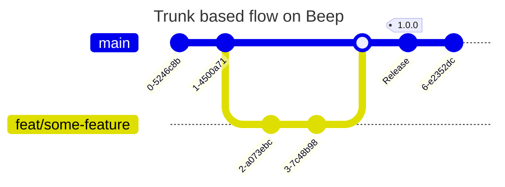
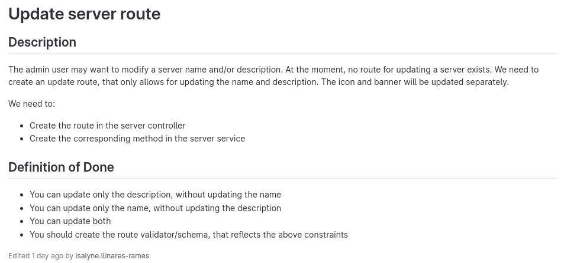
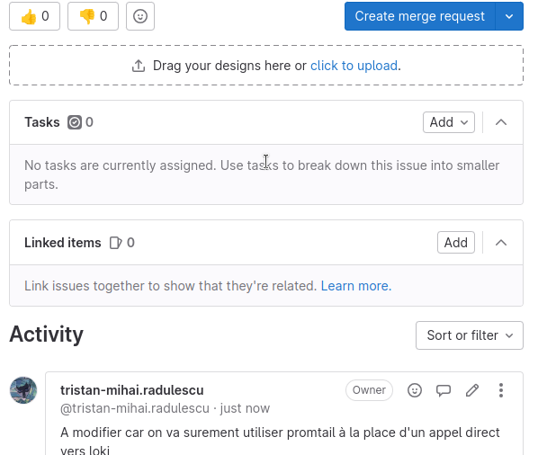
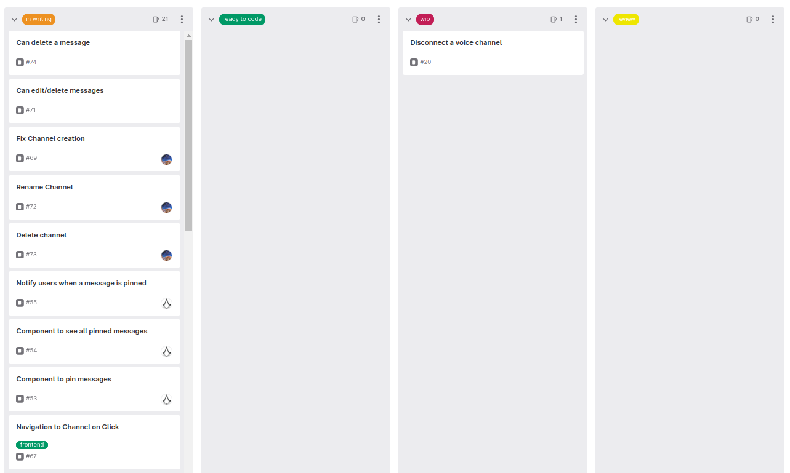
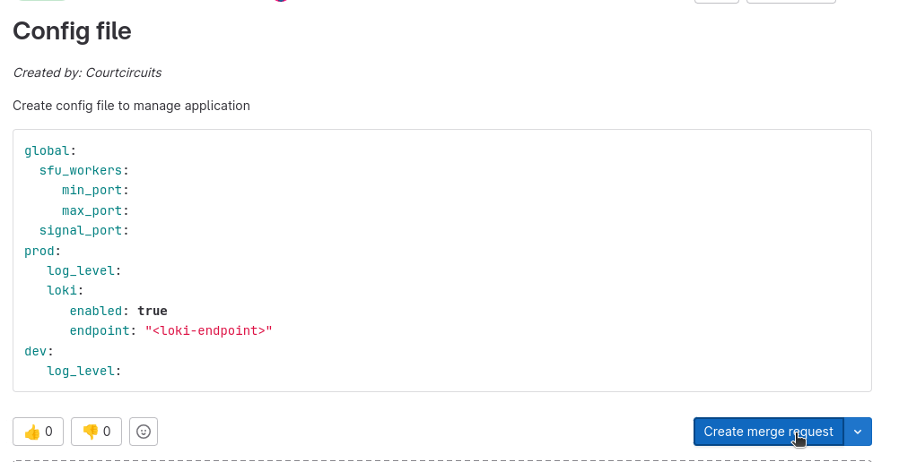

# Contribution Guide

_Pull requests, bug reports, and all other forms of contribution are welcomed and highly encouraged!_

This guides serves to set clear expectations for everyone involved with the projecty so that we can improve it. Therefore, this guide will cover in a few steps the cycle of life of a feature.

:::note
Every projects/services built in the scope of Beep **must** follow this contribution guide.
These projects are :

- [beep-app](https://gitlab.polytech.umontpellier.fr/beep/front)
- [beep-api](https://gitlab.polytech.umontpellier.fr/beep/api)
- [beep-sfu](https://gitlab.polytech.umontpellier.fr/beep/beep-rtc)
- [beep-docs](https://gitlab.polytech.umontpellier.fr/beep/docs)

:::

## TLDR

A feature must pass by the following steps before shipping :

1. An **issue**, describing in details a bug, or a feature request and what are the criteria validating the issue.
2. A **merge request**, which is the implementation of the feature. A merge request can also be linked to a documentation detailling the issues encountered during the implementation and explaining some in-depth concepts.
3. At least **two reviews**. These reviews must be done by two members that are not the feature developer.
4. Once the merge request is merged, the commit **must be tagged** to be deployed into production.

## Git flow (trunk-based)

The beep core team chose a **trunk-based** flow to version the project. To understand our decision please refer to this [ADR](https://file.notion.so/f/f/2679eb9e-5121-4ebf-8bd7-7ef6524a8805/3a563cbe-941c-41ed-bc57-afe7fc25251d/ADR_Git_workflow.pdf?id=a8b83d24-e30d-47de-bec5-12c9f45478f1&table=block&spaceId=2679eb9e-5121-4ebf-8bd7-7ef6524a8805&expirationTimestamp=1717459200000&signature=VVqL_Npb07ssVeR_GlsPtYcqSzY5Txs0Clm7IbTmfSk&downloadName=ADR+Git+workflow.pdf).



## Issues

### Content
Everything starts with an issue. An issue must contain a **description** of the feature or the bug that must be implemented, a definition of done, some ideas on how it should be implemented (facultative) and a difficulty/importance estimation A definition of done is a set of tests explaining how the feature/bug should be tested and validated.


> _Example of issue well written_

To sort issues, it's highly recommended to assign labels to issue (e.g. `frontend`, `bug`, `feature request`).
Once an issue has been written its status is set to `In writing`.
### Status
An issue must pass by these status before being merged : 
- `In writing`  : the issue is in writing and has not been reviewed yet so its not ready to be coded.
  :::warning
  There should be no discussions about the issue outside of the **Activity** section. Please use it !!!
  :::
  
- `Ready to code` : the issue has been reviewed by at least **one review** and therefore is ready to be coded.
- `WIP` : a merge request has been linked to the issue and the issue is being implemented.
- `review` : the merge request is waiting to be reviewed by at least **two reviewers**. These reviewers must test the issue by **running the code** and following the steps described by the **definition of done**.

### List of kanbans
- **App** : https://gitlab.polytech.umontpellier.fr/beep/front/-/boards
- **Api** : https://gitlab.polytech.umontpellier.fr/beep/api/-/boards
- **Docs** : https://gitlab.polytech.umontpellier.fr/beep/docs/-/boards
- **SFU** : https://gitlab.polytech.umontpellier.fr/beep/beep-rtc/-/boards
## Merge request
### How to create a merge request ?
Once an issue has reach the status of `ready to code`, you can pick it to implement it ! It's recommended to send a quick message on Discord to give visibility on the issues taken.

To pick an issue, go to its dedicated page (not on the kanban) and click on the `Create merge request` button.

This action will create a new merge request and a new git branch. You will be redirected to the merge request page. There give some insight about the implementation such as who will implement the issue, which issue it closes, maybe the difficulties you encontered while implementing it.

**Example of merge request description :**
```
Closes #4
In immplementation by @Alice
Must be reviewed by @Bob and @Tom

Here is a beautiful drawing explaining how I'm currently implementing my feature : 
  
                               +---------+
             +--------+        |Signaling|         +--------+
             | STUN   |        |Server   |         | STUN   |
             | Server |        +---------+         | Server |
             +--------+       /           \        +--------+
                             /             \
                            /               \
                           / <- Signaling -> \
                          /                   \
                   +--------+               +--------+
                   |  NAT   |               |  NAT   |
                   +--------+               +--------+
                      /                             \
                     /                               \
                 +-------+                       +-------+
                 | Agent |                       | Agent |
                 |   L   |                       |   R   |
                 +-------+                       +-------+
```

### How to implement a merge request ?
Now, to implement your merge request go to your project folder in your terminal.
```bash
$ git fetch
$ git checkout <my-merge-request-branch>
```
You can now implement your issue, to upload your changes use the classic :
```bash
$ git add .
$ git commit -m "<a-commit-message>"
$ git push origin <my-merge-request-branch>
```
Let's say that someone merged changes on your source branch which **must** be main since we use a `trunk-based` flow. You need to `rebase` your current branch on the parent branch like that  :
```bash
$ git pull --rebase origin main
```
Unfortunately, some file are conflicting between your current branch and the branch you rebased on.
To fix it, go to each file you need to fix, stage the changes and continue your rebase like that :
```
$ git pull --rebase origin main
⚠️ conflicts with main on index.ts
$ vim index.ts                                   # fix conflicts
$ git add index.ts
$ git rebase --continue                
                                                 # fix other conflicts if needed
$ git push origin <my-merge-request-branch> --force-with-lease
```
:::note
You need to force push to your merge request branch after a rebase because when rebasing you are rewriting your `HEAD`.
To get more information about rebase : https://git-scm.com/docs/git-rebase
:::
## Review
Once a merge request has been implemented, as a reviewer you must test the feature. There is several ways to make sure that an issue has been implemented correctly. First of all, follow the **definition of done** by running tests by hand. If you feel unit tests or integration tests are needed please add them !
## Ship the feature
To deploy the feature you must tag the last commit related to the merge request with the correct [semver](https://semver.org/lang/fr). You will found every deployed version in the [release section](./releases) or on Gitlab in the `tags` section.
:::warning
For now, the git flow to release a feature on the staging environment is far from perfect but for later, a feature MUST be tested in the staging environment before being shipped to the production environment.
:::
The CI/CD will execute the following actions :
1. Tests : It will lint and run the different tests defined in the project if there are any.
2. Publish :
   - Artifact : It will build a Docker image able to run the application
   - Helm : It will package an [helm chart](https://helm.sh/docs/intro/cheatsheet/#basic-interpretationscontext) describing the service infrastructure and specifying the new docker image to run.
Once each step has been succeeded, make sure that the feature has been deployed correctly thanks to [argocd](https://argocd.duratm.com/).
## Contribute to the documentation
### Add content
First you need to create an issue and a merge request as described earlier.
Then, go to the `content/` folder and edit/create new files by respecting the following structure : 
```
.
├── config.json
├── docs                                  # folder containing all docs
│   ├── <category-1>
│   │   ├── images/
│   │   ├── <doc-1>.md
│   │   └── <doc-2>.md
│   ├── <category-2>
│   │   └── <doc-1>.md
│   ├── db.json
```

To publish your documentation you then need to edit the `db.json` file by adding to the file a new JSON object : 
```json
[
...
{
    "permalink": "<relative-url-to-your-doc>", // the prefix will be applied directly. See the `src/collection.ts` file for the collection prefix
    "title": "<doc-title>",
    "contentPath": "<path-to-your-doc>",
    "category": "<doc-category>"
}
]
```

:::note
The `docs` project follow the same flow as any other beep project, so to ship a new version of the doc follow the same rules as any other service.
:::

Before pushing your changes, make sure that your `.md` files follow the correct standards. To do so, you have two ways : 
- **cli**: 
  ```bash
  npm install -g markdownlint-cli
  cd content
  markdownlint docs/
```
- **VSCode extenstion** : Install the [markdown lint](https://marketplace.visualstudio.com/items?itemName=DavidAnson.vscode-markdownlint) extension.